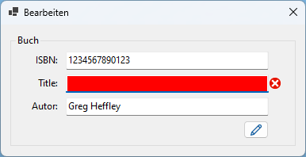
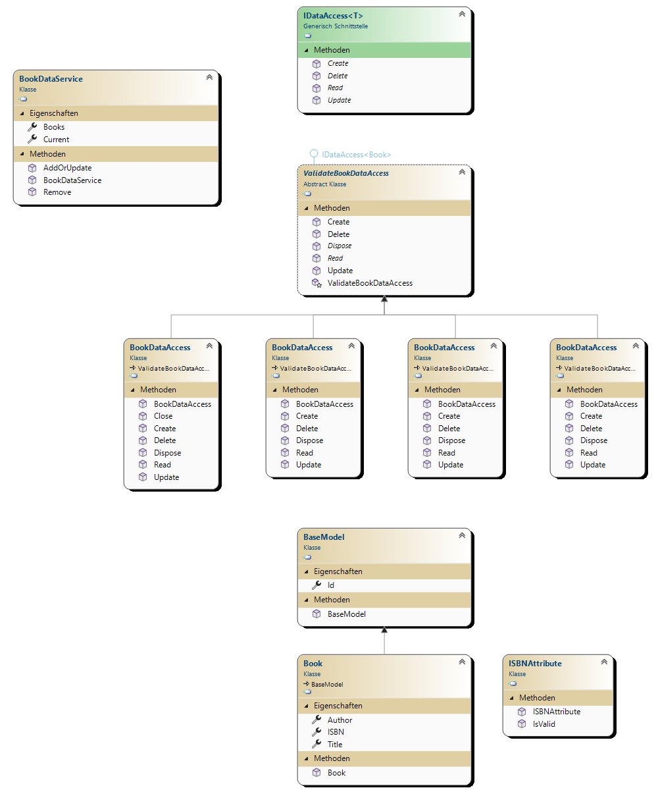

# C# library example

## Program Layout

| Main | Add | Update |
|------|-----|--------|
|  |  |  |

---

## Example Program with abstraction

The example program with abstraction includes a modular `DataService` which is implemented by different libraries e.g.:

1. ListDataService
1. SQLiteDataService
1. DbDataService

The `DataService` library implements the Validation of the `Book` objects.

### `ListDataService`

Implements a simple list in backend and is designed for testing purpose.

### `SQLiteDataService`

Data is saved in a SQLite database

### `DbDataService`

Can be used within every database that inherits from `DbConnection` and `DbCommand` (e.g. `mSQL`, `MySQL`, `mariaDB`, `...`).

### Global class diagram

---

R. GÄCHTER